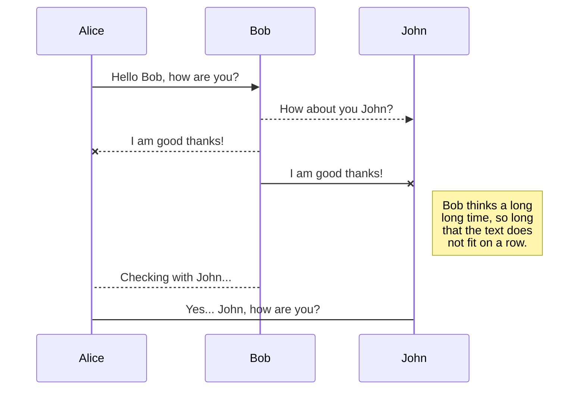

# This is a test doc page

Some examples of things you can do in docs.

## Code highlighting

Code blocks now support:

### Highlighting words individually

```python highlight=strawberry,str
import strawberry


@strawberry.type
class X:
    name: str
```

### Highlighting lines

```python lines=1-4
import strawberry


@strawberry.type
class X:
    name: str
```

### Add notes to code comments

This is probably not implemented in the best way, but for now it works:

```python
import strawberry

#      ^^^^^^^^^^
#      This is a note about this line


# this is a standard comment
@strawberry.type
class X:
    name: str
```

<CodeNotes id="info">Strawberry is a cool library</CodeNotes>

### Split code blocks

You can show two different code blocks next to each other (useful when comparing
the GraphQL schema against the Python definition):

<CodeGrid>

```python
import strawberry


@strawberry.type
class Query:
    @strawberry.field
    def ping(self) -> str:
        return "pong"
```

```graphql
type Query {
  ping: String!
}
```

</CodeGrid>

or when showing the request and response to a query:

```graphql+response
{
  ping
}
---
{
  "data": {
    "ping": "pong"
  }
}
```

## Call out blocks

<Tip>

This is a tip. Useful information is contained here.

</Tip>

<Note>

This is a note. Something that you should know about.

</Note>

<Warning>

This is a warning. Something that you should be careful about.

</Warning>

## Blockquote

> This is a quote


