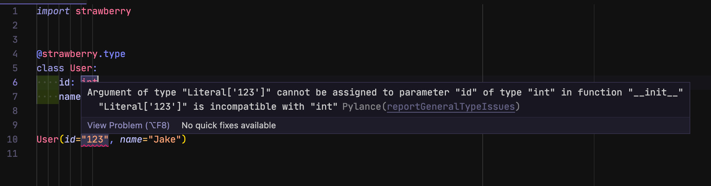

# Visual studio code

Strawberry comes with support for both MyPy and Pylance, Microsoft's own
language server for Python.

This guide will explain how to configure Visual Studio Code and Pylance to work
with Strawberry.

## Install Pylance

The first thing we need to do is to install
[Pylance](https://marketplace.visualstudio.com/items?itemName=ms-python.vscode-pylance),
this is the extension that enables type checking and intellisense for Visual
Studio Code.

Once the extension is installed, we need to configure it to enable type
checking. To do so we need to change or add the following two settings:

```json
{
  "python.languageServer": "Pylance",
  "python.analysis.typeCheckingMode": "basic"
}
```

The first settings tells the editor to use Pylance as the language server. The
second setting tells the editor to enable type checking by using the basic type
checking mode. At the moment strict mode is not supported.

Once you have configured the settings, you can restart VS Code and you should be
getting type checking errors in vscode.

<!--  -->
