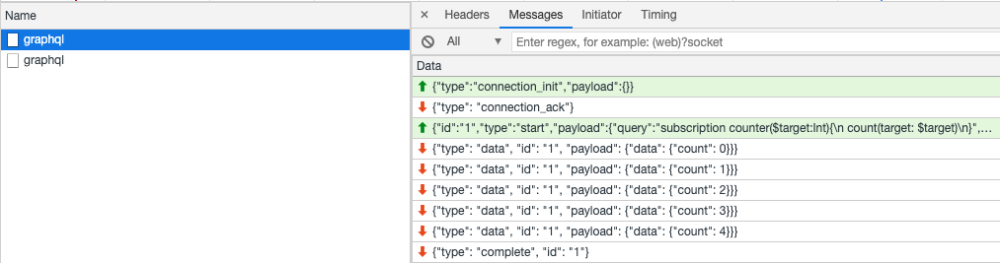

# Subscriptions

In GraphQL you can use subscriptions to stream data from a server. To enable
this with Strawberry your server must support ASGI and websockets or use the
AIOHTTP integration.

This is how you define a subscription-capable resolver:

```python
import asyncio
from typing import AsyncGenerator

import strawberry


@strawberry.type
class Query:
    @strawberry.field
    def hello(self) -> str:
        return "world"


@strawberry.type
class Subscription:
    @strawberry.subscription
    async def count(self, target: int = 100) -> AsyncGenerator[int, None]:
        for i in range(target):
            yield i
            await asyncio.sleep(0.5)


schema = strawberry.Schema(query=Query, subscription=Subscription)
```

Like queries and mutations, subscriptions are defined in a class and passed to
the Schema function. Here we create a rudimentary counting function which counts
from 0 to the target sleeping between each loop iteration.

<Note>

The return type of `count` is `AsyncGenerator` where the first generic argument
is the actual type of the response, in most cases the second argument should be
left as `None` (more about Generator typing
[here](https://docs.python.org/3/library/typing.html#typing.AsyncGenerator)).

</Note>

We would send the following GraphQL document to our server to subscribe to this
data stream:

```graphql
subscription {
  count(target: 5)
}
```

In this example, the data looks like this as it passes over the websocket:



This is a very short example of what is possible. Like with queries and
mutations the subscription can return any GraphQL type, not only scalars as
demonstrated here.

## Authenticating Subscriptions

Without going into detail on [why](https://github.com/websockets/ws/issues/467),
custom headers cannot be set on websocket requests that originate in browsers.
Therefore, when making any GraphQL requests that rely on a websocket connection,
header-based authentication is impossible.

Other popular GraphQL solutions, like Apollo for example, implement
functionality to pass information from the client to the server at the point of
websocket connection initialisation. In this way, information that is relevant
to the websocket connection initialisation and to the lifetime of the connection
overall can be passed to the server before any data is streamed back by the
server. As such, it is not limited to only authentication credentials!

Strawberry's implementation follows that of Apollo's, which as documentation for
[client](https://www.apollographql.com/docs/react/data/subscriptions/#5-authenticate-over-websocket-optional)
and
[server](https://www.apollographql.com/docs/apollo-server/data/subscriptions/#operation-context)
implementations, by reading the contents of the initial websocket connection
message into the `info.context` object.

With Apollo-client as an example of how to send this initial connection
information, one defines a `ws-link` as:

```javascript
import { GraphQLWsLink } from "@apollo/client/link/subscriptions";
import { createClient } from "graphql-ws";

const wsLink = new GraphQLWsLink(
  createClient({
    url: "ws://localhost:4000/subscriptions",
    connectionParams: {
      authToken: "Bearer I_AM_A_VALID_AUTH_TOKEN",
    },
  }),
);
```

and then, upon the establishment of the Susbcription request and underlying
websocket connection, Strawberry injects this `connectionParams` object as
follows:

```python
import asyncio
from typing import AsyncGenerator

import strawberry

from .auth import authenticate_token


@strawberry.type
class Query:
    @strawberry.field
    def hello(self) -> str:
        return "world"


@strawberry.type
class Subscription:
    @strawberry.subscription
    async def count(
        self, info: strawberry.Info, target: int = 100
    ) -> AsyncGenerator[int, None]:
        connection_params: dict = info.context.get("connection_params")
        token: str = connection_params.get(
            "authToken"
        )  # equal to "Bearer I_AM_A_VALID_AUTH_TOKEN"
        if not authenticate_token(token):
            raise Exception("Forbidden!")
        for i in range(target):
            yield i
            await asyncio.sleep(0.5)


schema = strawberry.Schema(query=Query, subscription=Subscription)
```

Strawberry expects the `connection_params` object to be any type, so the client
is free to send any valid JSON object as the initial message of the websocket
connection, which is abstracted as `connectionParams` in Apollo-client, and it
will be successfully injected into the `info.context` object. It is then up to
you to handle it correctly!

## Advanced Subscription Patterns

Typically a GraphQL subscription is streaming something more interesting back.
With that in mind your subscription function can return one of:

- `AsyncIterator`, or
- `AsyncGenerator`

Both of these types are documented in [PEP-525][pep-525]. Anything yielded from
these types of resolvers will be shipped across the websocket. Care needs to be
taken to ensure the returned values conform to the GraphQL schema.

The benefit of an AsyncGenerator, over an iterator, is that the complex business
logic can be broken out into a separate module within your codebase. Allowing
you to keep the resolver logic succinct.

The following example is similar to the one above, except it returns an
AsyncGenerator to the ASGI server which is responsible for streaming
subscription results until the Generator exits.

```python
import strawberry
import asyncio
import asyncio.subprocess as subprocess
from asyncio import streams
from typing import Any, AsyncGenerator, AsyncIterator, Coroutine, Optional


async def wait_for_call(coro: Coroutine[Any, Any, bytes]) -> Optional[bytes]:
    """
    wait_for_call calls the supplied coroutine in a wait_for block.

    This mitigates cases where the coroutine doesn't yield until it has
    completed its task. In this case, reading a line from a StreamReader; if
    there are no `\n` line chars in the stream the function will never exit
    """
    try:
        return await asyncio.wait_for(coro(), timeout=0.1)
    except asyncio.TimeoutError:
        pass


async def lines(stream: streams.StreamReader) -> AsyncIterator[str]:
    """
    lines reads all lines from the provided stream, decoding them as UTF-8
    strings.
    """
    while True:
        b = await wait_for_call(stream.readline)
        if b:
            yield b.decode("UTF-8").rstrip()
        else:
            break


async def exec_proc(target: int) -> subprocess.Process:
    """
    exec_proc starts a sub process and returns the handle to it.
    """
    return await asyncio.create_subprocess_exec(
        "/bin/bash",
        "-c",
        f"for ((i = 0 ; i < {target} ; i++)); do echo $i; sleep 0.2; done",
        stdout=subprocess.PIPE,
    )


async def tail(proc: subprocess.Process) -> AsyncGenerator[str, None]:
    """
    tail reads from stdout until the process finishes
    """
    # Note: race conditions are possible here since we're in a subprocess. In
    # this case the process can finish between the loop predicate and the call
    # to read a line from stdout. This is a good example of why you need to
    # be defensive by using asyncio.wait_for in wait_for_call().
    while proc.returncode is None:
        async for l in lines(proc.stdout):
            yield l
    else:
        # read anything left on the pipe after the process has finished
        async for l in lines(proc.stdout):
            yield l


@strawberry.type
class Query:
    @strawberry.field
    def hello() -> str:
        return "world"


@strawberry.type
class Subscription:
    @strawberry.subscription
    async def run_command(self, target: int = 100) -> AsyncGenerator[str, None]:
        proc = await exec_proc(target)
        return tail(proc)


schema = strawberry.Schema(query=Query, subscription=Subscription)
```

[pep-525]: https://www.python.org/dev/peps/pep-0525/

## Unsubscribing subscriptions

In GraphQL, it is possible to unsubscribe from a subscription. Strawberry
supports this behaviour, and is done using a `try...except` block.

In Apollo-client, closing a subscription can be achieved like the following:

```javascript
const client = useApolloClient();
const subscriber = client.subscribe({query: ...}).subscribe({...})
// ...
// done with subscription. now unsubscribe
subscriber.unsubscribe();
```

Strawberry can capture when a subscriber unsubscribes using an
`asyncio.CancelledError` exception.

```python
import asyncio
from typing import AsyncGenerator
from uuid import uuid4

import strawberry

# track active subscribers
event_messages = {}


@strawberry.type
class Subscription:
    @strawberry.subscription
    async def message(self) -> AsyncGenerator[int, None]:
        try:
            subscription_id = uuid4()

            event_messages[subscription_id] = []

            while True:
                if len(event_messages[subscription_id]) > 0:
                    yield event_messages[subscription_id]
                    event_messages[subscription_id].clear()

                await asyncio.sleep(1)
        except asyncio.CancelledError:
            # stop listening to events
            del event_messages[subscription_id]
```

## GraphQL over WebSocket protocols

Strawberry support both the legacy
[graphql-ws](https://github.com/apollographql/subscriptions-transport-ws) and
the newer recommended
[graphql-transport-ws](https://github.com/enisdenjo/graphql-ws) WebSocket
sub-protocols.

<Note>

The `graphql-transport-ws` protocols repository is called `graphql-ws`. However,
`graphql-ws` is also the name of the legacy protocol. This documentation always
refers to the protocol names.

</Note>

Note that the `graphql-ws` sub-protocol is mainly supported for backwards
compatibility. Read the
[graphql-ws-transport protocols announcement](https://the-guild.dev/blog/graphql-over-websockets)
to learn more about why the newer protocol is preferred.

Strawberry allows you to choose which protocols you want to accept. All
integrations supporting subscriptions can be configured with a list of
`subscription_protocols` to accept. By default, all protocols are accepted.

##### AIOHTTP

```python
from strawberry.aiohttp.views import GraphQLView
from strawberry.subscriptions import GRAPHQL_TRANSPORT_WS_PROTOCOL, GRAPHQL_WS_PROTOCOL
from api.schema import schema


view = GraphQLView(
    schema, subscription_protocols=[GRAPHQL_TRANSPORT_WS_PROTOCOL, GRAPHQL_WS_PROTOCOL]
)
```

##### ASGI

```python
from strawberry.asgi import GraphQL
from strawberry.subscriptions import GRAPHQL_TRANSPORT_WS_PROTOCOL, GRAPHQL_WS_PROTOCOL
from api.schema import schema


app = GraphQL(
    schema,
    subscription_protocols=[
        GRAPHQL_TRANSPORT_WS_PROTOCOL,
        GRAPHQL_WS_PROTOCOL,
    ],
)
```

##### Django + Channels

```python
import os

from django.core.asgi import get_asgi_application
from strawberry.channels import GraphQLProtocolTypeRouter

os.environ.setdefault("DJANGO_SETTINGS_MODULE", "mysite.settings")
django_asgi_app = get_asgi_application()

# Import your Strawberry schema after creating the django ASGI application
# This ensures django.setup() has been called before any ORM models are imported
# for the schema.
from mysite.graphql import schema


application = GraphQLProtocolTypeRouter(
    schema,
    django_application=django_asgi_app,
)
```

Note: Check the [channels integraton](../integrations/channels.md) page for more
information regarding it.

#### FastAPI

```python
from strawberry.fastapi import GraphQLRouter
from strawberry.subscriptions import GRAPHQL_TRANSPORT_WS_PROTOCOL, GRAPHQL_WS_PROTOCOL
from fastapi import FastAPI
from api.schema import schema

graphql_router = GraphQLRouter(
    schema,
    subscription_protocols=[
        GRAPHQL_TRANSPORT_WS_PROTOCOL,
        GRAPHQL_WS_PROTOCOL,
    ],
)
app = FastAPI()
app.include_router(graphql_router, prefix="/graphql")
```

### Single result operations

In addition to _streaming operations_ (i.e. subscriptions), the
`graphql-transport-ws` protocol supports so called _single result operations_
(i.e. queries and mutations).

This enables clients to use one protocol and one connection for queries,
mutations and subscriptions. Take a look at the
[protocols repository](https://github.com/enisdenjo/graphql-ws) to learn how to
correctly set up the graphql client of your choice.

Strawberry supports single result operations out of the box when the
`graphql-transport-ws` protocol is enabled. Single result operations are normal
queries and mutations, so there is no need to adjust any resolvers.
