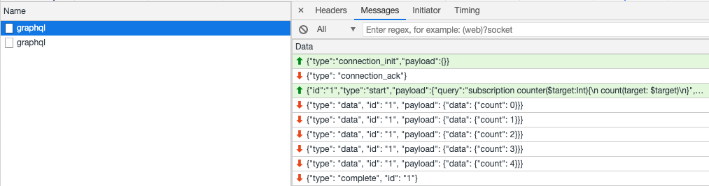

# Subscriptions

In GraphQL you can use subscriptions to stream data from a server. To enable
this with Strawberry, use an integration that supports a streaming transport
such as websockets, multipart HTTP, or Server-Sent Events (SSE).

This is how you define a subscription-capable resolver:

```python
import asyncio
from typing import AsyncGenerator

import strawberry


@strawberry.type
class Query:
    @strawberry.field
    def hello(self) -> str:
        return "world"


@strawberry.type
class Subscription:
    @strawberry.subscription
    async def count(self, target: int = 100) -> AsyncGenerator[int, None]:
        for i in range(target):
            yield i
            await asyncio.sleep(0.5)


schema = strawberry.Schema(query=Query, subscription=Subscription)
```

Like queries and mutations, subscriptions are defined in a class and passed to
the Schema function. Here we create a rudimentary counting function which counts
from 0 to the target sleeping between each loop iteration.

<Note>

The return type of `count` is `AsyncGenerator` where the first generic argument
is the actual type of the response, in most cases the second argument should be
left as `None` (more about Generator typing
[here](https://docs.python.org/3/library/typing.html#typing.AsyncGenerator)).

</Note>

We would send the following GraphQL document to our server to subscribe to this
data stream:

```graphql
subscription {
  count(target: 5)
}
```

In this example, the data looks like this as it passes over the websocket:



This is a very short example of what is possible. Like with queries and
mutations the subscription can return any GraphQL type, not only scalars as
demonstrated here.

## Authenticating Subscriptions

Without going into detail on [why](https://github.com/websockets/ws/issues/467),
custom headers cannot be set on websocket requests that originate in browsers.
Therefore, when making any GraphQL requests that rely on a websocket connection,
header-based authentication is impossible.

Other popular GraphQL solutions, like Apollo for example, implement
functionality to pass information from the client to the server at the point of
websocket connection initialisation. In this way, information that is relevant
to the websocket connection initialisation and to the lifetime of the connection
overall can be passed to the server before any data is streamed back by the
server. As such, it is not limited to only authentication credentials!

Strawberry's implementation follows that of Apollo's, which as documentation for
[client](https://www.apollographql.com/docs/react/data/subscriptions/#5-authenticate-over-websocket-optional)
and
[server](https://www.apollographql.com/docs/apollo-server/data/subscriptions/#operation-context)
implementations, by reading the contents of the initial websocket connection
message into the `info.context` object.

With Apollo-client as an example of how to send this initial connection
information, one defines a `ws-link` as:

```javascript
import { GraphQLWsLink } from "@apollo/client/link/subscriptions";
import { createClient } from "graphql-ws";

const wsLink = new GraphQLWsLink(
  createClient({
    url: "ws://localhost:4000/subscriptions",
    connectionParams: {
      authToken: "Bearer I_AM_A_VALID_AUTH_TOKEN",
    },
  }),
);
```

and then, upon the establishment of the Susbcription request and underlying
websocket connection, Strawberry injects this `connectionParams` object as
follows:

```python
import asyncio
from typing import AsyncGenerator

import strawberry

from .auth import authenticate_token


@strawberry.type
class Query:
    @strawberry.field
    def hello(self) -> str:
        return "world"


@strawberry.type
class Subscription:
    @strawberry.subscription
    async def count(
        self, info: strawberry.Info, target: int = 100
    ) -> AsyncGenerator[int, None]:
        connection_params: dict = info.context.get("connection_params")
        token: str = connection_params.get(
            "authToken"
        )  # equal to "Bearer I_AM_A_VALID_AUTH_TOKEN"
        if not authenticate_token(token):
            raise Exception("Forbidden!")
        for i in range(target):
            yield i
            await asyncio.sleep(0.5)


schema = strawberry.Schema(query=Query, subscription=Subscription)
```

Strawberry expects the `connection_params` object to be any type, so the client
is free to send any valid JSON object as the initial message of the websocket
connection, which is abstracted as `connectionParams` in Apollo-client, and it
will be successfully injected into the `info.context` object. It is then up to
you to handle it correctly!

## Using SSE Subscriptions

Server-Sent Events (SSE) are an HTTP-based alternative to websockets for
server-to-client streaming. SSE is opt-in; enable it by including
`GRAPHQL_SSE_PROTOCOL` in your integration's `subscription_protocols`:

```python
from strawberry.asgi import GraphQL
from strawberry.subscriptions import (
    GRAPHQL_SSE_PROTOCOL,
    GRAPHQL_TRANSPORT_WS_PROTOCOL
)

from api.schema import schema

app = GraphQL(
    schema,
    subscription_protocols=[
        GRAPHQL_TRANSPORT_WS_PROTOCOL,
        GRAPHQL_SSE_PROTOCOL
    ],
)
```

Then request an SSE response by sending a normal GraphQL HTTP request with
`Accept: text/event-stream`:

```http
POST /graphql
Accept: text/event-stream
Content-Type: application/json

{"query": "subscription { count(target: 5) }"}
```

Strawberry sends each execution result as a `next` event and sends a `complete`
event when the operation finishes:

```text
event: next
data: {"data": {"count": 0}}

event: complete
data:
```

Most applications should use a GraphQL SSE client rather than parsing the event
stream directly. For example, with
[`graphql-sse`](https://github.com/enisdenjo/graphql-sse):

```javascript
import { createClient } from "graphql-sse";

const client = createClient({
  url: "http://localhost:8000/graphql",
});

const dispose = client.subscribe(
  {
    query: "subscription { count(target: 5) }",
  },
  {
    next: (result) => {
      console.log(result.data);
    },
    error: console.error,
    complete: () => {
      console.log("done");
    },
  },
);

// Call this when the UI no longer needs the subscription.
dispose();
```

<Note>

**Prefer HTTP/2 for SSE.** Strawberry uses one SSE response per operation. When
browsers connect over HTTP/1.x they allow only a small number of concurrent
connections to the same origin (commonly six), so multiple long-lived
subscriptions — across tabs, or alongside other requests to the same origin —
can exhaust that limit and stall the page. HTTP/2 multiplexes many streams over
a single connection and removes this bottleneck.

Most ASGI servers, including `uvicorn`, serve HTTP/1.1 only, so HTTP/2 is
typically provided by a reverse proxy (such as Nginx, Caddy, or a cloud load
balancer) terminating in front of your app. If you cannot run HTTP/2, prefer
websockets for subscriptions that need several concurrent streams.

</Note>

Strawberry also sends SSE comment heartbeats on idle streams. SSE clients ignore
comment lines, but they keep intermediaries from closing long-lived connections
that have not produced a GraphQL result recently.

SSE responses are sent with `Cache-Control: no-cache, no-transform` and
`X-Accel-Buffering: no` so that Nginx and similar proxies do not buffer or
compress the stream. Response-compression middleware running inside your own
application — such as Starlette/FastAPI's `GZipMiddleware` or a brotli
middleware — buffers the response before it reaches those proxies and will break
real-time delivery and heartbeats regardless of these headers. Exclude your
GraphQL/SSE routes from such middleware.

### Limitations

<Note>

**Distinct connections mode only.** The
[GraphQL over SSE protocol](https://github.com/enisdenjo/graphql-sse/blob/master/PROTOCOL.md)
defines two modes. Strawberry implements the
["distinct connections mode"](https://github.com/enisdenjo/graphql-sse/blob/master/PROTOCOL.md#distinct-connections-mode),
where each operation gets its own SSE response. This is the default for the
`graphql-sse` client; the multiplexed
["single connection mode"](https://github.com/enisdenjo/graphql-sse/blob/master/PROTOCOL.md#single-connection-mode)
(`createClient({ singleConnection: true })`, which reserves a token over `PUT`
and routes operations through one stream) is **not** supported.

</Note>

SSE responses are streamed and therefore require an async integration that
supports streaming responses: ASGI, FastAPI, AIOHTTP, Litestar, Quart, Sanic,
async Django, and async Channels. The Flask (sync and async), Chalice, sync
Django, and sync Channels integrations cannot stream SSE.

By default Strawberry does not set an `id` field on events, so a dropped
connection means starting a new subscription operation. If your event source is
resumable, you can opt into reconnection support — see
[Resuming after a reconnect](#resuming-after-a-reconnect).

### Authenticating SSE subscriptions

SSE subscriptions use normal HTTP requests. Unlike websockets, browser SSE
clients can send HTTP authentication data such as cookies, query parameters,
and, when using a client based on `fetch`, custom headers like `Authorization`.
Native `EventSource` does not allow custom headers, so use cookies, query
parameters, or a `fetch`-based GraphQL SSE client when you need header-based
authentication in the browser.

Use your integration's `get_context` hook for SSE authentication, like you would
for queries and mutations. Strawberry also mirrors the `Authorization` header
into `context["connection_params"]["authorization"]` for parity with
WebSocket subscriptions, so a single resolver can serve both transports:

```python
from starlette.requests import Request
from starlette.responses import Response

from strawberry.asgi import GraphQL


class AuthenticatedGraphQL(GraphQL):
    async def get_context(self, request: Request, response: Response):
        return {
            "request": request,
            "response": response,
            "token": request.headers.get("Authorization"),
        }
```

Then read the value from `info.context` in your resolver:

```python
import asyncio
from typing import AsyncGenerator

import strawberry

from .auth import authenticate_token


@strawberry.type
class Subscription:
    @strawberry.subscription
    async def count(
        self, info: strawberry.Info, target: int = 100
    ) -> AsyncGenerator[int, None]:
        # Works for both WebSocket and SSE subscriptions
        token = info.context["connection_params"]["authorization"]
        if not authenticate_token(token):
            raise Exception("Forbidden!")

        for i in range(target):
            yield i
            await asyncio.sleep(0.5)
```

To accept or reject an SSE connection at the transport level, override the
`on_sse_connect` hook on your view. Raise `ConnectionRejectionError` to reject;
the client receives an SSE `error` event followed by `complete`:

```python
from strawberry.exceptions import ConnectionRejectionError
from strawberry.asgi import GraphQL


class AuthenticatedGraphQL(GraphQL):
    async def on_sse_connect(self, context):
        token = context["connection_params"].get("authorization")
        if not authenticate_token(token):
            raise ConnectionRejectionError(
                {"message": "Invalid token", "code": "INVALID_TOKEN"}
            )
```

### Resuming after a reconnect

Strawberry never buffers or replays past results, but if your event source is
resumable (a message broker with offsets, a database cursor, and so on) you can
let clients resume after a dropped connection.

A reconnecting client sends the id of the last event it received in the
`Last-Event-ID` request header. Since SSE is a normal HTTP request, read that
header from the request — which integrations already place in the context — and
resume from it:

```python
@strawberry.type
class Subscription:
    @strawberry.subscription
    async def notifications(
        self, info: strawberry.Info
    ) -> AsyncGenerator[Notification, None]:
        request = info.context["request"]
        cursor = request.headers.get("last-event-id")  # None on first connect

        async for notification in stream_notifications(after=cursor):
            yield notification
```

<Note>

Like the [`graphql-sse`](https://github.com/enisdenjo/graphql-sse) reference
implementation, Strawberry does not emit SSE `id:` lines, so the native browser
`EventSource` (which resends `Last-Event-ID` only from server-sent `id:` lines)
will not resume automatically. This is for clients that carry a cursor in the
GraphQL data itself and set `Last-Event-ID` on reconnect.

</Note>

## Advanced Subscription Patterns

Typically a GraphQL subscription is streaming something more interesting back.
With that in mind your subscription function can return one of:

- `AsyncIterator`, or
- `AsyncGenerator`

Both of these types are documented in [PEP-525][pep-525]. Anything yielded from
these types of resolvers will be shipped across the websocket. Care needs to be
taken to ensure the returned values conform to the GraphQL schema.

The benefit of an AsyncGenerator, over an iterator, is that the complex business
logic can be broken out into a separate module within your codebase. Allowing
you to keep the resolver logic succinct.

The following example is similar to the one above, except it returns an
AsyncGenerator to the ASGI server which is responsible for streaming
subscription results until the Generator exits.

```python
import strawberry
import asyncio
import asyncio.subprocess as subprocess
from asyncio import streams
from typing import Any, AsyncGenerator, AsyncIterator, Coroutine, Optional


async def wait_for_call(coro: Coroutine[Any, Any, bytes]) -> Optional[bytes]:
    """
    wait_for_call calls the supplied coroutine in a wait_for block.

    This mitigates cases where the coroutine doesn't yield until it has
    completed its task. In this case, reading a line from a StreamReader; if
    there are no `\n` line chars in the stream the function will never exit
    """
    try:
        return await asyncio.wait_for(coro(), timeout=0.1)
    except asyncio.TimeoutError:
        pass


async def lines(stream: streams.StreamReader) -> AsyncIterator[str]:
    """
    lines reads all lines from the provided stream, decoding them as UTF-8
    strings.
    """
    while True:
        b = await wait_for_call(stream.readline)
        if b:
            yield b.decode("UTF-8").rstrip()
        else:
            break


async def exec_proc(target: int) -> subprocess.Process:
    """
    exec_proc starts a sub process and returns the handle to it.
    """
    return await asyncio.create_subprocess_exec(
        "/bin/bash",
        "-c",
        f"for ((i = 0 ; i < {target} ; i++)); do echo $i; sleep 0.2; done",
        stdout=subprocess.PIPE,
    )


async def tail(proc: subprocess.Process) -> AsyncGenerator[str, None]:
    """
    tail reads from stdout until the process finishes
    """
    # Note: race conditions are possible here since we're in a subprocess. In
    # this case the process can finish between the loop predicate and the call
    # to read a line from stdout. This is a good example of why you need to
    # be defensive by using asyncio.wait_for in wait_for_call().
    while proc.returncode is None:
        async for l in lines(proc.stdout):
            yield l
    else:
        # read anything left on the pipe after the process has finished
        async for l in lines(proc.stdout):
            yield l


@strawberry.type
class Query:
    @strawberry.field
    def hello() -> str:
        return "world"


@strawberry.type
class Subscription:
    @strawberry.subscription
    async def run_command(self, target: int = 100) -> AsyncGenerator[str, None]:
        proc = await exec_proc(target)
        return tail(proc)


schema = strawberry.Schema(query=Query, subscription=Subscription)
```

[pep-525]: https://www.python.org/dev/peps/pep-0525/

## Unsubscribing subscriptions

In GraphQL, it is possible to unsubscribe from a subscription. Strawberry
supports this behaviour, and is done using a `try...except` block.

In Apollo-client, closing a subscription can be achieved like the following:

```javascript
const client = useApolloClient();
const subscriber = client.subscribe({query: ...}).subscribe({...})
// ...
// done with subscription. now unsubscribe
subscriber.unsubscribe();
```

Strawberry can capture when a subscriber unsubscribes using an
`asyncio.CancelledError` exception.

```python
import asyncio
from typing import AsyncGenerator
from uuid import uuid4

import strawberry

# track active subscribers
event_messages = {}


@strawberry.type
class Subscription:
    @strawberry.subscription
    async def message(self) -> AsyncGenerator[int, None]:
        try:
            subscription_id = uuid4()

            event_messages[subscription_id] = []

            while True:
                if len(event_messages[subscription_id]) > 0:
                    yield event_messages[subscription_id]
                    event_messages[subscription_id].clear()

                await asyncio.sleep(1)
        except asyncio.CancelledError:
            # stop listening to events
            del event_messages[subscription_id]
```

## Subscription Protocols

Strawberry supports both the legacy
[graphql-ws](https://github.com/apollographql/subscriptions-transport-ws) and
the newer recommended
[graphql-transport-ws](https://github.com/enisdenjo/graphql-ws) WebSocket
sub-protocols. Strawberry also supports GraphQL over SSE through
`GRAPHQL_SSE_PROTOCOL`.

<Note>

The `graphql-transport-ws` protocols repository is called `graphql-ws`. However,
`graphql-ws` is also the name of the legacy protocol. This documentation always
refers to the protocol names.

</Note>

Note that the `graphql-ws` sub-protocol is mainly supported for backwards
compatibility. Read the
[graphql-ws-transport protocols announcement](https://the-guild.dev/blog/graphql-over-websockets)
to learn more about why the newer protocol is preferred.

Strawberry allows you to choose which protocols you want to accept. All
integrations supporting subscriptions can be configured with a list of
`subscription_protocols` to accept. By default, the websocket protocols are
accepted. Multipart subscriptions and SSE are opt-in.

### AIOHTTP

```python
from strawberry.aiohttp.views import GraphQLView
from strawberry.subscriptions import (
    GRAPHQL_SSE_PROTOCOL,
    GRAPHQL_TRANSPORT_WS_PROTOCOL
)
from api.schema import schema

view = GraphQLView(
    schema,
    subscription_protocols=[
        GRAPHQL_TRANSPORT_WS_PROTOCOL,
        GRAPHQL_SSE_PROTOCOL
    ],
)
```

### ASGI

```python
from strawberry.asgi import GraphQL
from strawberry.subscriptions import (
    GRAPHQL_SSE_PROTOCOL,
    GRAPHQL_TRANSPORT_WS_PROTOCOL,
)
from api.schema import schema

app = GraphQL(
    schema,
    subscription_protocols=[
        GRAPHQL_TRANSPORT_WS_PROTOCOL,
        GRAPHQL_SSE_PROTOCOL,
    ],
)
```

### Django + Channels

```python
import os

from django.core.asgi import get_asgi_application
from strawberry.channels import GraphQLProtocolTypeRouter
from strawberry.subscriptions import (
    GRAPHQL_SSE_PROTOCOL,
    GRAPHQL_TRANSPORT_WS_PROTOCOL
)

os.environ.setdefault("DJANGO_SETTINGS_MODULE", "mysite.settings")
django_asgi_app = get_asgi_application()

# Import your Strawberry schema after creating the django ASGI application
# This ensures django.setup() has been called before any ORM models are imported
# for the schema.
from mysite.graphql import schema

application = GraphQLProtocolTypeRouter(
    schema,
    django_application=django_asgi_app,
    subscription_protocols=[
        GRAPHQL_TRANSPORT_WS_PROTOCOL,
        GRAPHQL_SSE_PROTOCOL,
    ],
)
```

Note: Check the [channels integraton](../integrations/channels.md) page for more
information regarding it.

### FastAPI

```python
from strawberry.fastapi import GraphQLRouter
from strawberry.subscriptions import (
    GRAPHQL_SSE_PROTOCOL,
    GRAPHQL_TRANSPORT_WS_PROTOCOL,

)
from fastapi import FastAPI
from api.schema import schema

graphql_router = GraphQLRouter(
    schema,
    subscription_protocols=[
        GRAPHQL_TRANSPORT_WS_PROTOCOL,
        GRAPHQL_SSE_PROTOCOL,
    ],
)

app = FastAPI()
app.include_router(graphql_router, prefix="/graphql")
```

### Quart

```python
from strawberry.quart.views import GraphQLView
from strawberry.subscriptions import (
    GRAPHQL_SSE_PROTOCOL,
    GRAPHQL_TRANSPORT_WS_PROTOCOL,
)
from quart import Quart
from api.schema import schema

view = GraphQLView.as_view(
    "graphql_view",
    schema=schema,
    subscription_protocols=[
        GRAPHQL_TRANSPORT_WS_PROTOCOL,
        GRAPHQL_SSE_PROTOCOL,
    ],
)

app = Quart(__name__)
app.add_url_rule(
    "/graphql",
    view_func=view,
    methods=["GET"],
    websocket=True,
)
```

## Single result operations

In addition to _streaming operations_ (i.e. subscriptions), the
`graphql-transport-ws` protocol supports so called _single result operations_
(i.e. queries and mutations).

This enables clients to use one protocol and one connection for queries,
mutations and subscriptions. Take a look at the
[protocol's repository](https://github.com/enisdenjo/graphql-ws) to learn how to
correctly set up the graphql client of your choice.

Strawberry supports single result operations out of the box when the
`graphql-transport-ws` protocol is enabled. Single result operations are normal
queries and mutations, so there is no need to adjust any resolvers.
