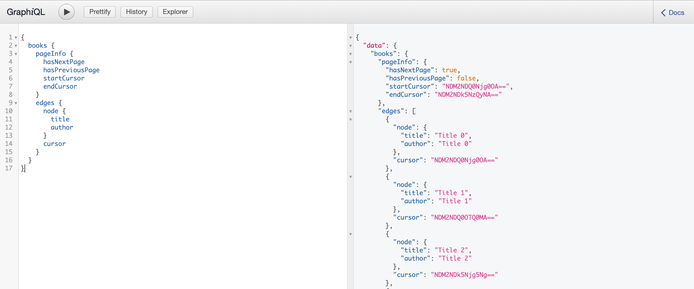

# Pagination

APIs commonly use pagination to efficiently return a portion of a result instead
of every single item, which can have inefficient performance.

The GraphQL spec [recommends cursor-based pagination](https://graphql.org/learn/pagination/)
and refers to [Relay's Connection Spec](https://relay.dev/graphql/connections.htm)
for specific implementation details.

Here we show a minimal example of how you can leverage Strawberry's generic Types
to build the types required to comply with the relay spec.

```python
import base64
from typing import List, Generic, TypeVar, Optional

import strawberry
from strawberry import UNSET


GenericType = TypeVar("GenericType")


@strawberry.type
class Connection(Generic[GenericType]):
    """Represents a paginated relationship between two entities

    This pattern is used when the relationship itself has attributes.
    In a Facebook-based domain example, a friendship between two people
    would be a connection that might have a `friendshipStartTime`
    """
    page_info: "PageInfo"
    edges: List["Edge[GenericType]"]


@strawberry.type
class PageInfo:
    """Pagination context to navigate objects with cursor-based pagination

    Instead of classic offset pagination via `page` and `limit` parameters,
    here we have a cursor of the last object and we fetch items starting from that one

    Read more at:
        - https://graphql.org/learn/pagination/#pagination-and-edges
        - https://relay.dev/graphql/connections.htm
    """
    has_next_page: bool
    has_previous_page: bool
    start_cursor: Optional[str]
    end_cursor: Optional[str]


@strawberry.type
class Edge(Generic[GenericType]):
    """An edge may contain additional information of the relationship. This is the trivial case"""
    node: GenericType
    cursor: str


@strawberry.type
class Book:
    title: str
    author: str

    @classmethod
    def from_db_model(cls, instance):
        """Adapt this method with logic to map your orm instance to a strawberry decorated class"""
        return cls(title=instance.title, author=instance.title)


def build_book_cursor(book: Book):
    """Adapt this method to build an *opaque* ID from an instance"""
    bookid = f"{id(book)}".encode("utf-8")
    return base64.b64encode(bookid).decode()


Cursor = str


def get_books(first: int = 10, after: Optional[Cursor] = UNSET) -> Connection[Book]:
    """
    A non-trivial implementation should efficiently fetch only
    the necessary books after the offset.
    For simplicity, here we build the list and then slice it accordingly
    """
    after = after if after is not UNSET else None

    # Fetch the requested books plus one, just to calculate `has_next_page`
    books = [
        Book(
            title=f"Title {x}",
            author=f"Author {x}",
        )
        for x in range(20)
    ][after:first+1]

    edges = [
        Edge(node=Book.from_db_model(book), cursor=build_book_cursor(book))
        for book in books
    ]

    return Connection(
        page_info=PageInfo(
            has_previous_page=False,
            has_next_page=len(books) > first,
            start_cursor=edges[0].cursor if edges else None,
            end_cursor=edges[-2].cursor if len(edges) > 1 else None,
        ),
        edges=edges[:-1]  # exclude last one as it was fetched to know if there is a next page
    )


@strawberry.type
class Query:
    books: Connection[Book] = strawberry.field(resolver=get_books)

schema = strawberry.Schema(query=Query)
```

Name your file `pagination.py` and run `strawberry server pagination`

When you visit the GraphQL URL from your terminal output, you should see something like this:

