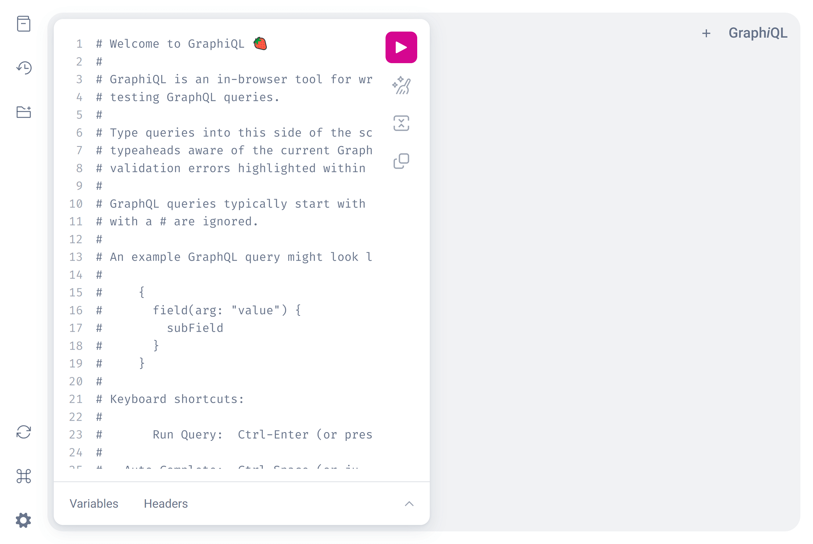

# Getting started with Strawberry

This tutorial will help you:

- Obtain a basic understanding of GraphQL principles
- Define a GraphQL schema using Strawberry
- Run the Strawberry server that lets you execute queries against your schema

This tutorial assumes that you are familiar with the command line and Python,
and that you have a recent version of Python (3.9+) installed.

Strawberry is built on top of Python’s
[dataclasses](https://realpython.com/python-data-classes/) and
[type hints](https://docs.python.org/3/library/typing.html) functionality.

## Step 1: Create a new project and install Strawberry

Let’s create a new folder:

```shell
mkdir strawberry-demo
cd strawberry-demo
```

After that we need a new virtualenv:

```shell
python -m venv virtualenv
```

Activate the virtualenv and then install strawberry plus the debug server.

```shell
source virtualenv/bin/activate
pip install 'strawberry-graphql[debug-server]'
```

## Step 2: Define the schema

Every GraphQL server uses a **schema** to define the structure of the data that
clients can query. In this example, we will create a server for querying a
collection of books by title and author.

In your favorite editor create a file called `schema.py`, with the following
contents:

```python
import typing
import strawberry


@strawberry.type
class Book:
    title: str
    author: str


@strawberry.type
class Query:
    books: typing.List[Book]
```

This will create a GraphQL schema where clients will be able to execute a query
named `books` that will return a list of zero or more books.

## Step 3: Define your data set

Now that we have our structure of your schema, we can define the data itself.
Strawberry can work with any data source (for example a database, a REST API,
files, etc). For this tutorial we will be using hard-coded data.

Let’s create a function that returns some books.

```python
def get_books():
    return [
        Book(
            title="The Great Gatsby",
            author="F. Scott Fitzgerald",
        ),
    ]
```

Since strawberry makes uses of python classes to create the schema, this means
that we can also reuse them to create the data objects.

## Step 4: Define a resolver

We now have a function that returns some books, but Strawberry doesn’t know it
should use it when executing a query. To fix this we need to update our query to
specify the [resolver](/docs/types/resolvers) for our books. A resolver tells
Strawberry how to fetch the data associated with a particular field.

Let’s update our Query:

```python
@strawberry.type
class Query:
    books: typing.List[Book] = strawberry.field(resolver=get_books)
```

Using `strawberry.field` allows us to specify a resolver for a particular field.

<Note>

We didn't have to specify any resolver for the Book's fields, this is because
Strawberry adds a default for each field, returning the value of that field.

</Note>

## Step 5: Create our schema and run it

We have defined our data and query, now what we need to do is create a GraphQL
schema and start the server.

To create the schema add the following code:

```python
schema = strawberry.Schema(query=Query)
```

Then run the following command

```shell
strawberry server schema
```

This will start a debug server, you should see the following output:

```text
Running strawberry on http://0.0.0.0:8000/graphql 🍓
```

## Step 6: execute your first query

We can now execute GraphQL queries. Strawberry comes with a tool called
**GraphiQL**. To open it go to
[http://0.0.0.0:8000/graphql](http://0.0.0.0:8000/graphql)

You should see something like this:



The GraphiQL UI includes:

- A text area (to the left) for writing queries
- A Play button (the triangle button in the middle) for executing queries
- A text area (to the right) for viewing query results Views for schema
  inspection and generated documentation (via tabs on the right side)

Our server supports a single query named books. Let's execute it!

Paste the following string into the left area and then click the play button:

```graphql
{
  books {
    title
    author
  }
}
```

You should see the hardcoded data appear on the right side:


GraphQL allows clients to query only the fields they need, go ahead and remove
`author` from the query and run it again. The response should now only show the
title for each book.

## Next steps

<!--alex ignore retext-equality -->

Well done! You just created your first GraphQL API using Strawberry 🙌!

Check out the following resources to learn more about GraphQL and Strawberry.

- [Schema Basics](./general/schema-basics.md)
- [Resolvers](./types/resolvers.md)
- [Deployment](./operations/deployment.md)
